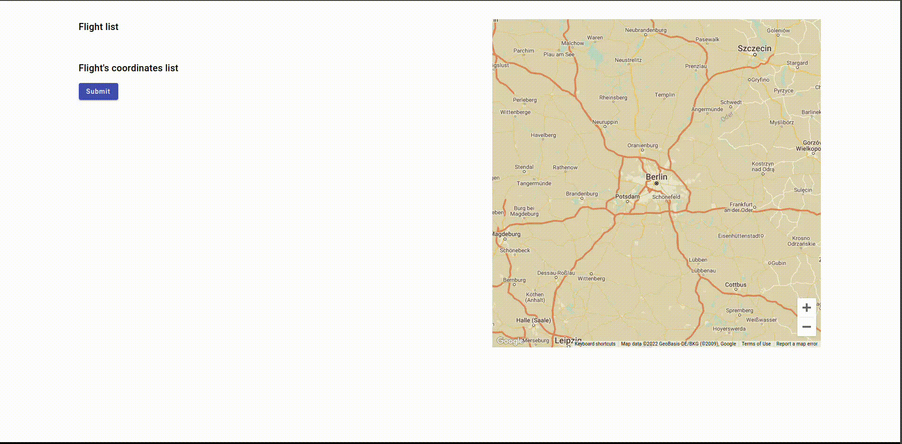

# FlightPlanner

This project was generated with [Angular CLI](https://github.com/angular/angular-cli) version 15.0.2.
## Project structure

### assets

- Common assets are stored here. They are accessible in all parent repos. It is unnecessary to add them to the parent repos again. The core assets url is `/assets/core`.

### components

- Simple reusable components.

- Ideal for presentational-only components or components with simple dependency injections.

### map

- Developed using @angular/google-maps

### modules

- Features with multiple related components and services.

- Used when a feature has multiple views or dialogs.
### store

- Currently, the state management has gone two iterations.

- You can find the commented out implementation using BehaviouralSubject and the current one done with ngrxStore

## Development server

Run `ng serve` for a dev server. Navigate to `http://localhost:4200/`. The application will automatically reload if you change any of the source files.

## Code scaffolding

Run `ng generate component component-name` to generate a new component. You can also use `ng generate directive|pipe|service|class|guard|interface|enum|module`.

## Build

Run `ng build` to build the project. The build artifacts will be stored in the `dist/` directory.

## Running unit tests

Run `ng test` to execute the unit tests via [Karma](https://karma-runner.github.io).

## Further help

To get more help on the Angular CLI use `ng help` or go check out the [Angular CLI Overview and Command Reference](https://angular.io/cli) page.

